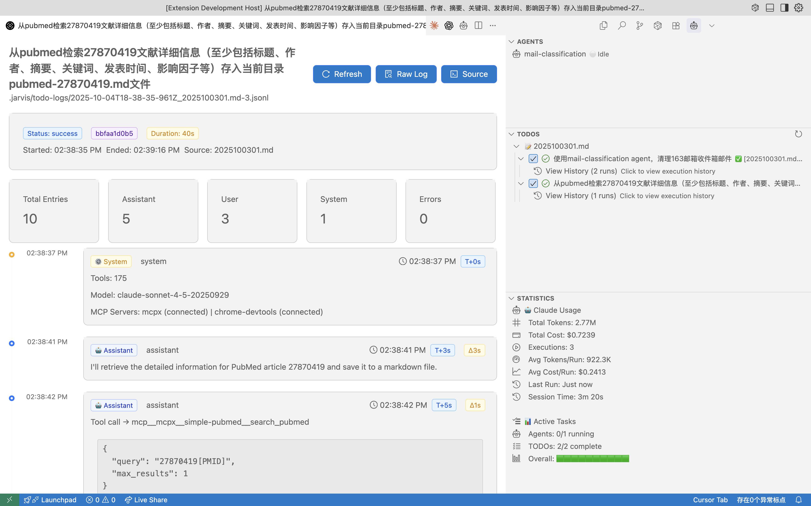
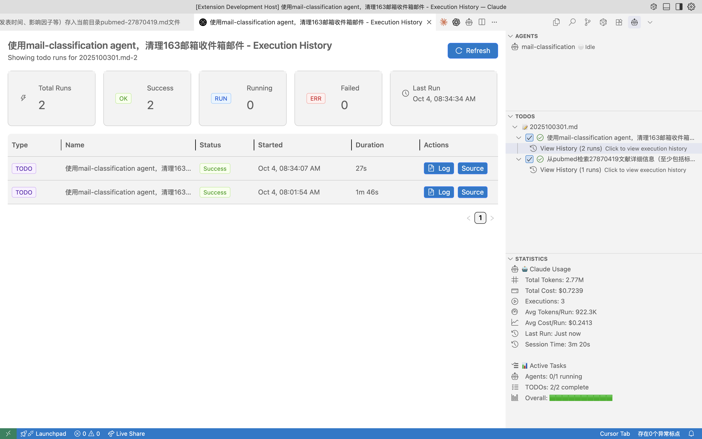

# Jarvis - Your Personal AI Assistant inside VSCode

LLMs are evolving fast — it’s time for a truly personal AI assistant. Jarvis turns plain text and TODO lists in VSCode into actionable tasks powered by AI agents. No web dashboards, no clutter — just write in markdown, and let Jarvis handle the rest:

- 📬 Auto-summarize and clean your inbox every morning
- 🧬 Fetch, clean, and visualize multi-omics data from GEO or other databases
- 🔄 More... (Customize your own agents and tools)
- 🪶 Keep full history and reports for review or QC agents

A text-driven workflow, a personal agent ecosystem, and the freedom to automate your day — all within VSCode.

A powerful VSCode extension for managing and executing AI-based agents with Claude Code integration. Jarvis provides a comprehensive interface for running subagents, managing TODO tasks, and tracking execution logs.

**📖 [中文文档](README_CN.md) | English Documentation**

## Features

### 🤖 Agent Management
- **Auto-discovery** of agent configurations from `.jarvis/agents/`
- **Real-time status monitoring** (idle, running, error, paused)
- **One-click execution** with customizable parameters
- **🆕 Auto-execution on file changes** with frequency control
- **🆕 Manual trigger** for immediate execution
- **🆕 Template variable support** for dynamic agent paths
- Support for both JSON and Markdown agent definitions
- Structured logging with JSONL format

### ✅ TODO Task Management
- Parse standard Markdown TODO syntax
- **Priority levels** (HIGH, MEDIUM, LOW)
- **Nested task support** with subtasks
- **Execution tracking** with status indicators
- Automatic task completion on successful execution

### 📊 Statistics Dashboard
- Real-time agent and TODO statistics
- Progress tracking with visual indicators
- Execution history and error reporting

### 🔧 Claude Code Integration
- Seamless integration with Claude Code CLI
- Configurable execution parameters
- Stream JSON output processing
- MCP (Model Context Protocol) support

## 🎬 Demo






## Installation

1. Install the extension from the VSCode Marketplace
2. Install Claude Code CLI:
   ```bash
   npm install -g @anthropic/claude-cli
   ```
3. Open a workspace folder in VSCode
4. Jarvis will automatically activate and create the `.jarvis` directory structure

## Quick Start

### Setting Up Agents

Create agent configurations in `.jarvis/agents/`:

**JSON Format** (`.jarvis/agents/my-agent.json`):
```json
{
  "name": "Code Reviewer",
  "description": "Reviews code for quality and best practices",
  "prompt": "Review the current codebase and provide feedback",
  "parameters": {
    "--model": "claude-sonnet-4-5-20250929"
  },
  "tags": ["review", "quality"]
}
```

**Markdown Format** (`.jarvis/agents/my-agent.md`):
```markdown
---
name: data-processor
description: Processes and transforms data files
tools:
model: claude-sonnet-4-5-20250929
---

## Description
Processes and transforms data files

## Prompt
Process the data files in the input directory and generate reports

## Parameters
- input_dir: Source data directory
- output_dir: Generated reports directory
- format: Output format (json, csv, xml)
```

### Creating TODOs

Add TODO files in `.jarvis/todos/`:

```markdown
# Project Tasks

- [ ] [HIGH] Implement authentication
  - [ ] Create login form
  - [ ] Add JWT handling
- [ ] [MEDIUM] Add tests
- [ ] [LOW] Update documentation
```

### Running Agents and TODOs

1. **Via UI**: Click the play button next to any agent or TODO in the sidebar
2. **Via Command Palette**:
   - `Jarvis: Start Agent`
   - `Jarvis: Execute TODO`
   - `Jarvis: Trigger Manual Execute` (🆕)
   - `Jarvis: Show Auto-Execute Status` (🆕)
3. **Via Context Menu**: Right-click on items in the tree view
4. **🆕 Auto-execution**: Configure automatic execution on file changes

## Configuration

Configure Jarvis through VSCode settings (`Cmd/Ctrl + ,`):

```json
{
  "jarvis.paths.agentDir": ".jarvis/agents",
  "jarvis.paths.logDir": ".jarvis/agent-logs",
  "jarvis.paths.todoDir": ".jarvis/todos",
  "jarvis.claude.executable": "claude",
  "jarvis.claude.defaultParams.model": "claude-sonnet-4-5-20250929",
  "jarvis.claude.defaultParams.temperature": 0.7,
  "jarvis.claude.defaultParams.max-tokens": 4096,
  "jarvis.ui.autoRefresh": true,
  "jarvis.ui.refreshInterval": 1000,
  "jarvis.logs.retentionDays": 30,
  "jarvis.autoExecute.enabled": true,
  "jarvis.autoExecute.agentName": "generate-claude-md",
  "jarvis.autoExecute.frequency": "daily"
}
```

### 🆕 Auto-Execute Configuration

Configure automatic agent execution when files change:

```json
{
  "jarvis.autoExecute.enabled": true,
  "jarvis.autoExecute.agentName": "generate-claude-md",
  "jarvis.autoExecute.frequency": "daily"
}
```

**Auto-execute options:**
- `enabled`: Enable/disable auto-execution
- `agentName`: Name of the agent to execute automatically
- `frequency`: Execution frequency (`daily`, `hourly`, `manual`)

**Features:**
- ✅ **File-change driven**: Only executes when files actually change
- ✅ **Frequency control**: Prevents excessive execution
- ✅ **Manual trigger**: Override frequency limits when needed
- ✅ **Status monitoring**: View execution status and file changes

## MCP Configuration

Configure MCP servers in `.jarvis/mcp-config.json`:

```json
{
  "mcpServers": {
    "mcpx": {
      "command": "npx",
      "args": ["@mcpx/mcpx"]
    },
    "chrome-devtools": {
      "command": "npx",
      "args": ["@mcpx/chrome-devtools-mcp"]
    }
  }
}
```

## Commands

| Command | Description |
|---------|-------------|
| `Jarvis: Start Agent` | Start an agent execution |
| `Jarvis: Stop Agent` | Stop a running agent |
| `Jarvis: Execute TODO` | Execute a TODO task |
| `Jarvis: Trigger Manual Execute` | 🆕 Manually trigger auto-execute agent |
| `Jarvis: Show Auto-Execute Status` | 🆕 View auto-execution status and file changes |
| `Jarvis: View Logs` | Open the logs directory |
| `Jarvis: Configure` | Open Jarvis settings |
| `Jarvis: Refresh Agents` | Reload agent configurations |
| `Jarvis: Refresh TODOs` | Reload TODO files |

## Directory Structure

```
.jarvis/
├── agents/              # Agent configuration files
│   ├── agent1.json
│   └── agent2.md
├── agent-logs/          # Agent execution logs
│   └── {agent-name}/
│       └── {timestamp}.jsonl
├── todos/               # TODO task files
│   ├── development.md
│   └── testing.md
├── todo-logs/           # TODO execution logs
│   └── {timestamp}_{task-id}.jsonl
└── mcp-config.json      # MCP server configuration
```

## Log Format

Logs are stored in JSONL format for easy parsing:

```jsonl
{"type":"system","content":[{"type":"text","text":"Starting execution"}],"timestamp":"2025-01-04T12:00:00.000Z"}
{"type":"assistant","message":{"content":[{"type":"text","text":"Processing task..."}]},"timestamp":"2025-01-04T12:00:01.000Z"}
{"type":"result","result":"Task completed successfully","timestamp":"2025-01-04T12:00:05.000Z"}
```

## Development

### Building from Source

```bash
# Install dependencies
npm install

# Compile TypeScript
npm run compile

# Watch mode for development
npm run watch

# Package extension
npm run package
```

### Testing

```bash
# Run tests
npm test

# Run with coverage
npm run test:coverage
```

## Troubleshooting

### Claude Code CLI Not Found
- Ensure Claude CLI is installed: `npm install -g @anthropic/claude-cli`
- Check the executable path in settings

### Agents Not Appearing
- Verify agent files are in `.jarvis/agents/`
- Check file format (JSON or Markdown)
- Look for syntax errors in agent definitions

### TODOs Not Updating
- Ensure TODO files use correct Markdown syntax
- Check file permissions
- Refresh the TODO view manually

### 🆕 Auto-Execute Not Working
- Check `jarvis.autoExecute.enabled` is set to `true`
- Verify `jarvis.autoExecute.agentName` matches an existing agent
- Use "Show Auto-Execute Status" command to check file changes
- Ensure agent files are in the correct directory
- Check frequency settings (`daily`, `hourly`, `manual`)

### 🆕 Manual Trigger Fails
- Confirm the agent name is correct
- Check if the agent is already running
- Verify the agent exists and is properly configured
- Check VS Code output panel for error details

## Contributing

Contributions are welcome! Please:

1. Fork the repository
2. Create a feature branch
3. Make your changes
4. Add tests
5. Submit a pull request

## License

MIT License - see LICENSE file for details

## Support

- **Issues**: [GitHub Issues](https://github.com/your-org/jarvis-vscode/issues)
- **Documentation**: [Wiki](https://github.com/your-org/jarvis-vscode/wiki)
- **🆕 Auto-Execute Guide**: [docs/agent-auto-execute-guide.md](docs/agent-auto-execute-guide.md)
- **🆕 Quick Reference**: [docs/agent-auto-execute-quick-reference.md](docs/agent-auto-execute-quick-reference.md)
- **🆕 FAQ**: [docs/agent-auto-execute-faq.md](docs/agent-auto-execute-faq.md)
- **Discord**: [Community Server](https://discord.gg/jarvis)

## Acknowledgments

- Built with [Claude Code](https://claude.ai) integration
- Powered by the VSCode Extension API
- Icons from VSCode Codicons

---

Made with ❤️ by the Jarvis Team